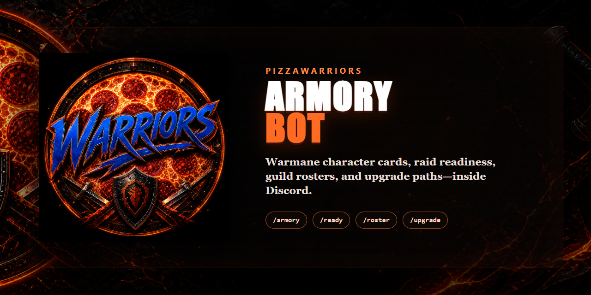
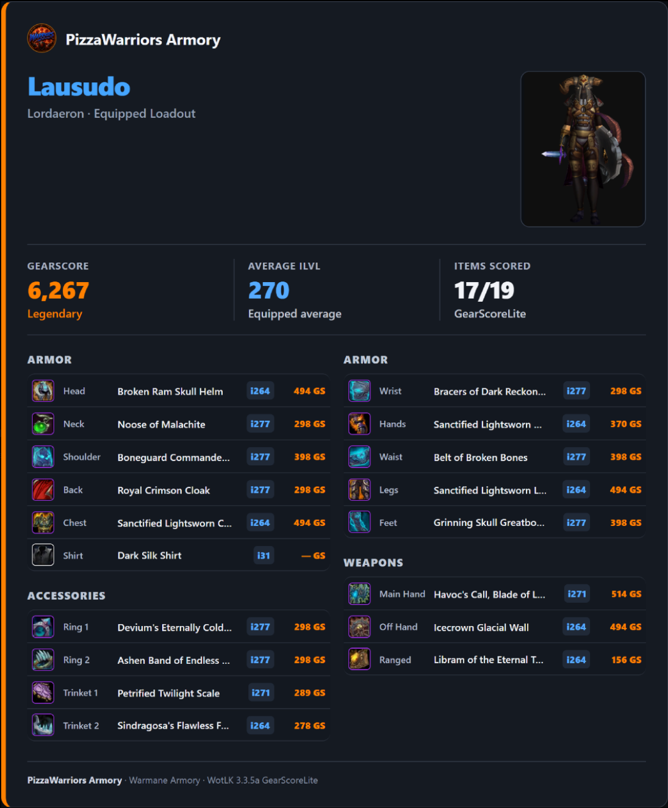

# PizzaWarriors Armory Bot

<p align="center">
  
</p>

<p align="center">
  <a href="https://github.com/CRSD-Lau/PizzaWarriors-Armory-Bot/actions/workflows/ci.yml"></a>
  
  
  
</p>

**A focused Discord armory and raid-readiness bot for Warmane characters.**

Look up a character with one slash command and receive a mobile-readable equipment card with real Warmane item icons, a live character render, average item level, and WotLK 3.3.5a GearScoreLite-compatible scoring.

<p align="center">
  
</p>

## What it does

- Posts `/armory name:<character> [realm]` results directly in Discord.
- Reads equipped slots and item icons from the Warmane Armory.
- Calculates WotLK 3.3.5a GearScoreLite, including Titan's Grip/two-hand handling.
- Generates a branded PizzaWarriors equipment card with legendary orange GearScore and blue iLvl hierarchy.
- Includes an **Open Armory** link and a resilient text-embed fallback.
- Turns a live Raid-Helper event into a raid-readiness card with attendee GS, iLvl, and selected spec.
- Browses the public Warmane guild roster in a branded 10-member Discord carousel.
- Builds upgrade cards directly from the PizzaWarriors Best-in-Slot Google Sheet, with owned-versus-target equipment.
- Runs without a database, web dashboard, message-content intent, or guild-roster sync.

## Commands

```text
/armory name:Lausudo realm:Lordaeron
```

```text
/ready event:<Raid-Helper message link or event ID> realm:Lordaeron
/raider link name:Lausudo realm:Lordaeron
/roster guild:"Pizza Warriors" realm:Lordaeron
/upgrade name:Lausudo realm:Lordaeron spec:Fury
```

`/ready` reads the public Raid-Helper event endpoint and checks active signed attendees against Warmane. If a member's Discord name is not their character name, they use `/raider link` once; the link is saved only on this host and only for this Discord server. Bench, late, tentative, and absent entries are excluded from the readiness total.

`/roster` defaults to **Pizza Warriors** on the configured realm. Its Previous and Next controls show ten characters at a time, while **Open Guild Armory** returns to the underlying public roster.

`/upgrade` loads its targets from the [PizzaWarriors Lordaeron Best-in-Slot List](https://docs.google.com/spreadsheets/d/1i5CFTZ8kIrISQzvNmJHx85smAYlkaCTO9q_UcsrcqqE/edit). The bot reads the selected class/spec column directly, caches it for five minutes, and links the exact class tab on every card. Update the sheet and the next fresh `/upgrade` request uses the new list—no code edit or bot restart is needed.

Supported realms are **Lordaeron**, **Icecrown**, and **Blackrock**. The configured default is Lordaeron. Anyone who can use the slash command may look up a public character; guild membership is intentionally not required.

## Requirements

- Node.js **24** or later
- Google Chrome (used in headless mode to render the card without opening terminal windows)
- A Discord application with a bot token and application ID

The bot needs only the `bot` and `applications.commands` invite scopes and the Discord **Guilds** gateway intent. It does not read channel messages or require a Raid-Helper API key.

## Quick start

```powershell
git clone https://github.com/CRSD-Lau/PizzaWarriors-Armory-Bot.git
Set-Location PizzaWarriors-Armory-Bot
npm ci
Copy-Item .env.example .env
notepad .env
npm run dev
```

Set `DISCORD_GUILD_ID` while testing so Discord registers the slash command in your server immediately. Without it, global command propagation can take time.

Required variables:

```dotenv
DISCORD_TOKEN=your-bot-token
DISCORD_CLIENT_ID=your-application-id
```

See [`.env.example`](.env.example) for the complete configuration reference. Never commit `.env`, a Discord token, or `WARMANE_COOKIE`.

## Production operation

The project includes a PM2 ecosystem file and quiet Windows recovery scripts.

```powershell
pm2 start ecosystem.config.cjs
pm2 save
pm2 status pizza-warriors-armory
Invoke-RestMethod http://127.0.0.1:3000/healthz
```

- `GET /healthz` returns `{ "ok": true }` for health probes.
- Item metadata is cached locally for 30 days in `.cache/items.json` to reduce upstream requests.
- Lookups are throttled per Discord user and server to protect Warmane and the local renderer.
- If Warmane presents a Cloudflare challenge, `WARMANE_COOKIE` can be set from a browser session you control. Treat it as a password.

## Architecture

```text
Discord slash command
        │
        ▼
Warmane Armory ──► item metadata + equipped icons
        │
        ▼
WotLK GearScoreLite scorer ──► PizzaWarriors card renderer ──► Discord attachment

Raid-Helper event ID ──► public event signups ──► Warmane character links ──► raid-readiness card

PizzaWarriors Best-in-Slot Sheet ──► selected class/spec column ──► upgrade-target card
```

The bot uses the Warmane armory grid for the equipped position and icon, then enriches each item with type, level, and quality. The scoring rules are adapted from Pizza Logs' tested GearScoreLite implementation.

## Development and validation

```powershell
npm run typecheck
npm test
npm audit --omit=dev
```

CI runs the same checks on Node 24. Review [the release checklist](docs/RELEASE-CHECKLIST.md) before deploying.

## Security and privacy

- Secrets, runtime cache, and logs are excluded from Git.
- Rendered item-icon URLs are limited to HTTPS Warmane hosts.
- Character and item text is escaped before card rendering.
- No Discord message content, guild roster, or player history is stored.
- Optional `/raider link` entries contain only Discord user ID, character name, and realm in `data/raider-links.json`; the file is excluded from Git.

Read the [security policy](SECURITY.md) and the current [security review](docs/SECURITY-REVIEW.md) before hosting or contributing.

## Contributing

Contributions should stay focused on fast, dependable armory lookup and a clean Discord presentation. Start with [CONTRIBUTING.md](CONTRIBUTING.md).

## License

The source is published for transparent version history and review, but remains an internal PizzaWarriors guild utility. No license for reuse is granted; see [LICENSE](LICENSE) and the `UNLICENSED` package declaration.
